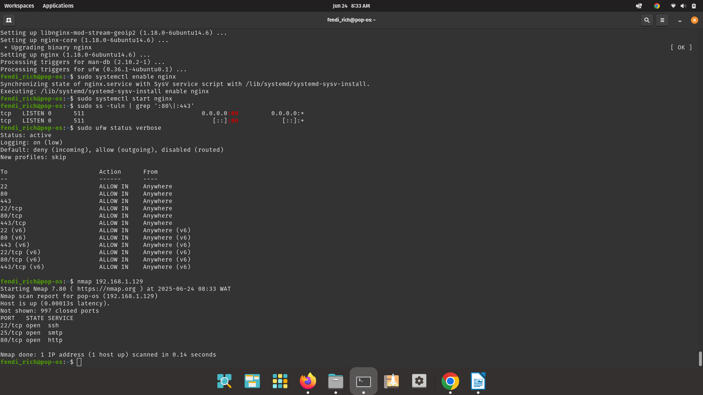
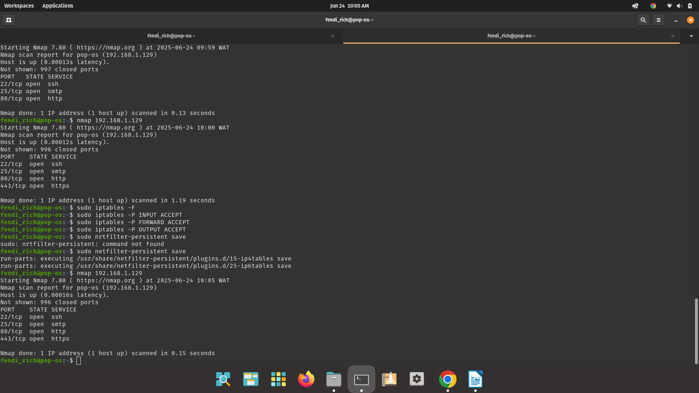
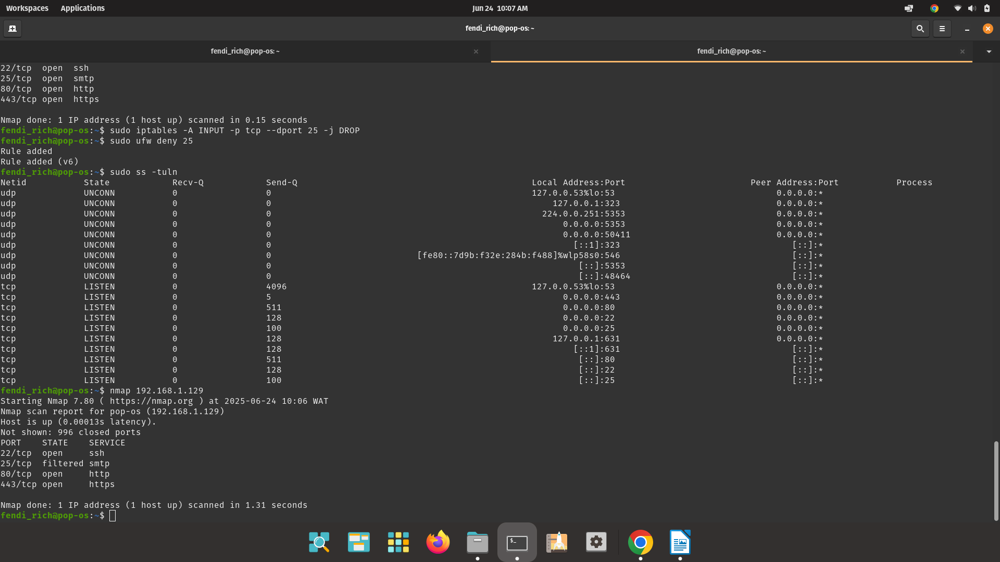

# BASIC LINUX FIREWALL WITH IPTABLE

A beginner-friendly cybersecurity project where I practiced scanning and securing a Linux machine using 'nmap', 'iptables' and 'ufw'. This project demonstrates how to use 'iptables' to configure a basic firewall on a Linux machine (Pop!_OS in this case). It also includes basic Nmap scanning to verify the open and closed ports before and after applying firewall rules.
 --
-
What You'll learn

- How to configure firewall using 'iptables'
- How to allow or block ports
- How to scan ports using 'nmap'
- Basics of Linux network security
 ---

Tools Used
- 'iptables'
- 'nmap'
- Pop!_OS (based on Ubuntu/Debian)
- Optional: 'ufw' (uncomplicated firewall)

 ---
Project Steps
1. Install necessary tools:
'''bash
sudo apt update
sudo apt install nmap 
sudo apt install iptables.

2. Set default rules (very important)
sudo ufw default deny incoming
sudo ufw default allow outgoing

3. Allow only specific ports(in this case I used SSH, HTTP, HTTPS)
sudo ufw allow 22 #SSH
sudo ufw allow 80 #HTTP
sudo ufw allow 443 #HTTPS

4. Run an Nmap scan before applying firewall rules:
sudo nmap -sS -T4 -Pn -v localhost
### Before Firewall Configuration

5. Create and run the firewall script:
nano iptables_rules.sh
Paste this:
#!/bin/bash
iptables -A INPUT -p tcp --dport 22 -j ACCEPT
iptables -A INPUT -p tcp --dport 80 -j ACCEPT
iptables -A INPUT -p tcp --dport 443 -j ACCEPT
iptables -A INPUT -p tcp --dport 25 -j DROP
iptables -P INPUT DROP

Make it executable and run:
chmod +x iptables_rules.sh
sudo ./iptables_rules.sh

### Iptable Rules

6. Run another Nmap scan to confirm changes:
sudo nmap -sS -T4 -Pn -v localhost

### After Firewall Configuration

7. Save the firewall rules(this is optional since they reset on reboot)
sudo iptables-save > /etc/iptables/rules.v4

 RESULTS
- Port 22(SSH): Open
- Port 80(HTTP): Open
- Port 443(HTTPS): Open
- Port 25(SMTP): Filtered
- All other ports: Denied by default

 BONUS
- Set rules to persist across reboots using iptables-persistent
- Add logging for dropped packets
- Block specific IP ranges
